# Lab 01 - Introduction to Custom Connectors

In this lab, you will go through the following tasks:

* Creating a new browser profile
* Logging into the account you are going to use during the workshop
* Creating developer environments
* Installing Visual Studio Code
* Installing the Power Platform Tools extension
* Connecting to the Power Platform environment

## Task 1: Create a new browser profile (Microsoft Edge)

It's always good to have a separate browser profile for your work and for workshops like this. This way you can keep all of your credentials separate and not have to worry about logging out of your personal / work accounts.

1. Open Microsoft Edge
2. Click on the profile icon on the top left corner
3. Hover over "Other Microsoft Edge Browsers" / "Other profiles" and then select **Add Browser** / **Add profile**

    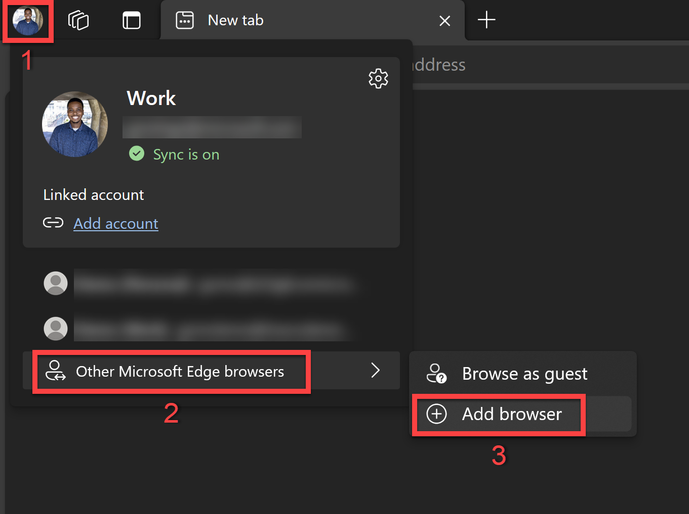

4. Click **Add**

    

    This will then open up a new browser window on your taskbar.

5. Pin that browser window to your taskbar
6. In the new browser window, select **Start without your data**

    

7. Then select **Confirm and start browsing**.

    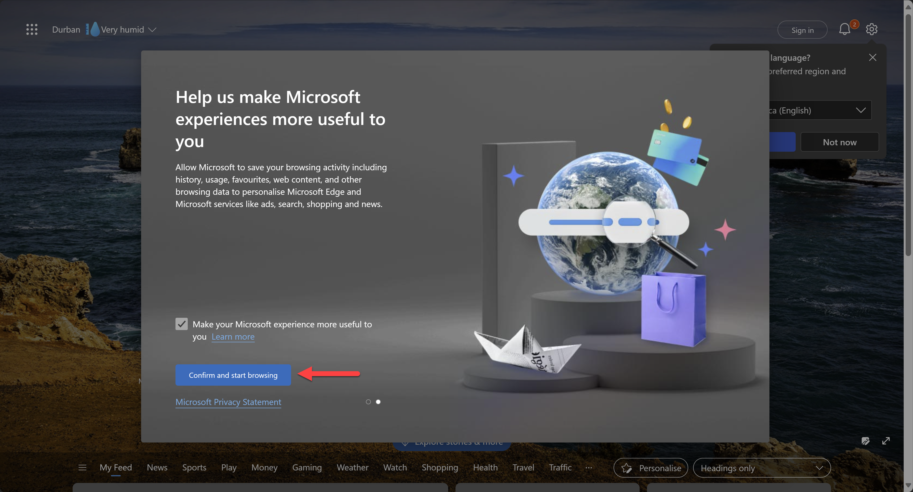

    It may prompt you to configure your new browser theme. If this happens, just select **Next** and then **Finish**.

## Task 2: Log on to your account

With the credentials that were provided to you, let's log into the account you are going to use during the workshop.

1. Go to [make.powerapps.com](https://make.powerapps.com)
2. On the sign-in screen, enter the email address that was provided to you and then click **Next**

    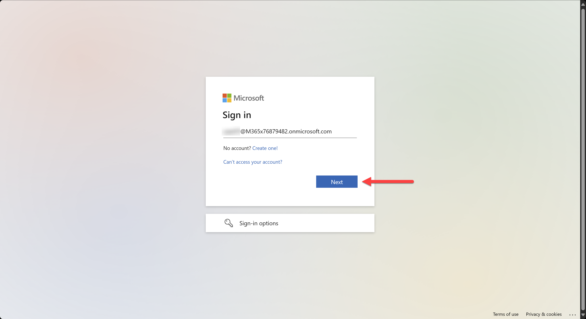

3. Then enter the password and click **Sign in**
    
    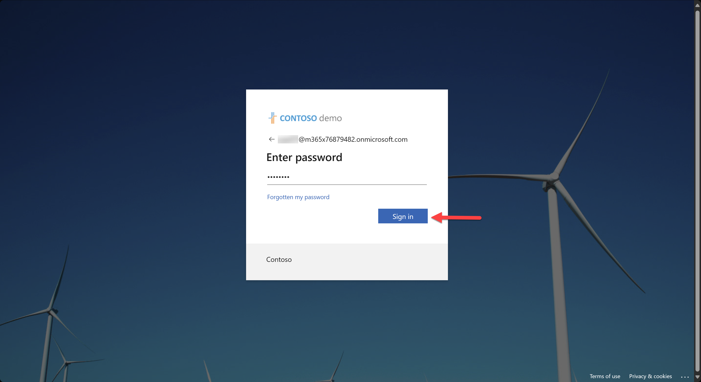

4. If you're prompted to stay signed in, click **Yes**

    You should now be logged in and on the Power Apps Home Page.

    

## Task 3: Create developer environments

Developer environments are very helpful when you want to try out features, they are meant to be short living environments.

For this workshop, we are going to create three different developer environments:

* ```Dev```: The environment where we are going to import our solution later on.
* ```Test```: The environment where we are going to deploy our solution to in lab four.
* ```Prod```: The environment where we are going to deploy our solution to in lab four.

To create developer environments, you can create them in two ways:

1. Via the Power Platform Admin Center
1. Via the Power Platform CLI

In this workshop, we will create the environments through the Power Platform Admin Center.

1. Go to the [Power Platform Admin Center](https://aka.ms/ppac)
2. Exit the Welcome / Tour pop up. You can do this by clicking on the **X** in the top right corner of the pop up screen

    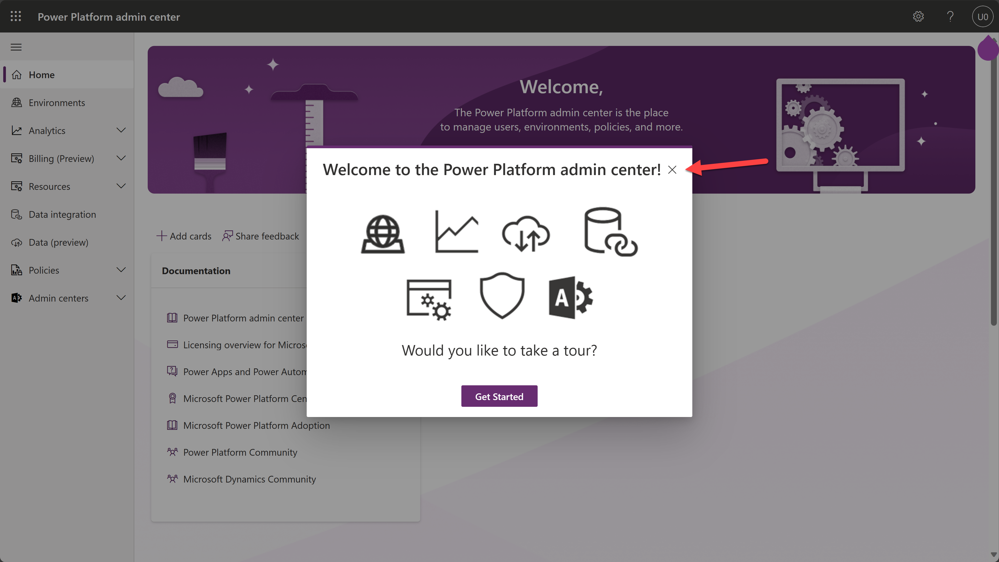

3. Click on **Environments** in the left navigation
4. Click on **New** in the top navigation

    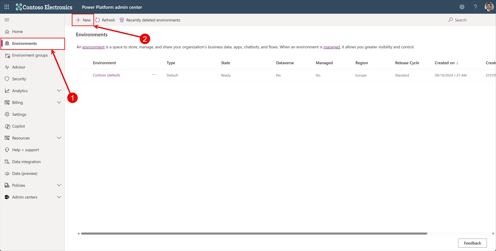

5. When the right-hand side dialog pops up - enter the following information:

    | Field | Value |
    | --- | --- |
    | Name | Dev |
    | Region | Europe - Default |
    | Type | Developer |
    | Purpose | Developer environment for EPPC23 |

    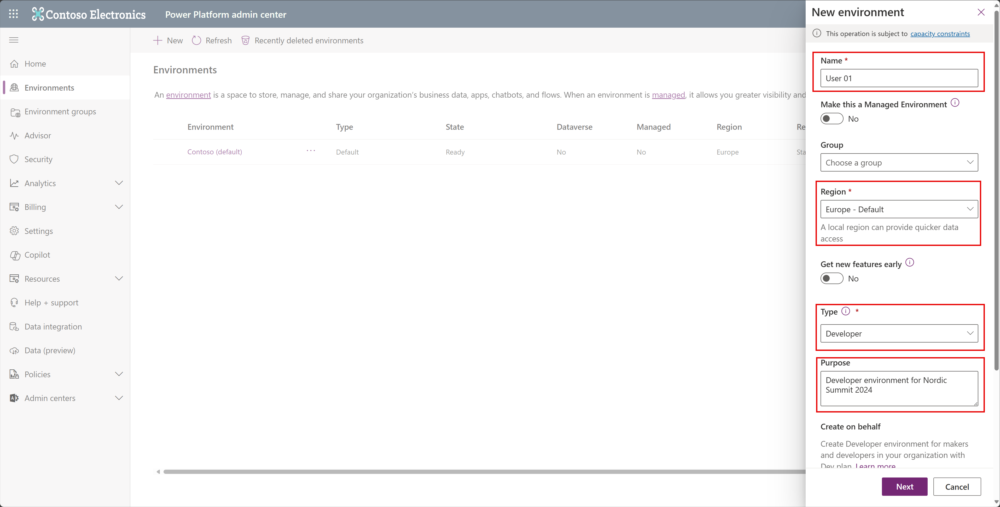

6. Click **Next**
7. The next section is asking you to add Dataverse. Finally Click on **Save**
8. Now do the same for the Test and Prod environments with the following information:

   ```Test Environment:```

    | Field | Value |
    | --- | --- |
    | Name | Test |
    | Region | Europe - Default |
    | Type | Developer |
    | Purpose | Developer environment for EPPC23 |

    ```Prod Environment:```
        
    | Field | Value |
    | --- | --- |
    | Name | Prod |
    | Region | Europe - Default |
    | Type | Developer |
    | Purpose | Developer environment for EPPC23 |

9. Once you have created all three environments, you should see them in the list of environments. Click the **Refresh** button on the top navigation if you don't see them yet.

    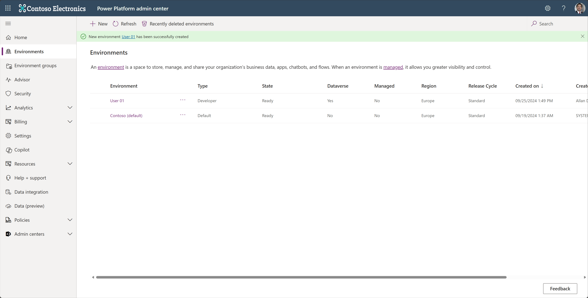

## Task 4: Install Visual Studio Code

If you already have Visual Studio Code installed, you can skip this step.

1. Go to the [website of Visual Studio Code](https://code.visualstudio.com/download) and download the version for your device.
1. Install Visual Studio Code.

## Task 5: Install the Power Platform Tools extension

The Power Platform Tools extension is a Visual Studio Code extension that allows you to interact with the Power Platform from within Visual Studio Code. It is a very important component of the ALM story for custom connectors and for this workshop.

1. Open Visual Studio code
1. In Visual Studio Code, click on the **Extensions** icon in the left navigation

    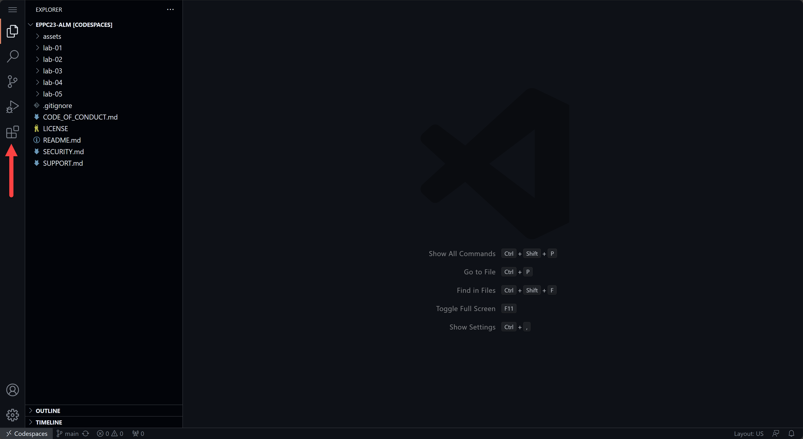

2. Search for **Power Platform Tools** and then click **Install** on the **Power Platform Tools** extension

    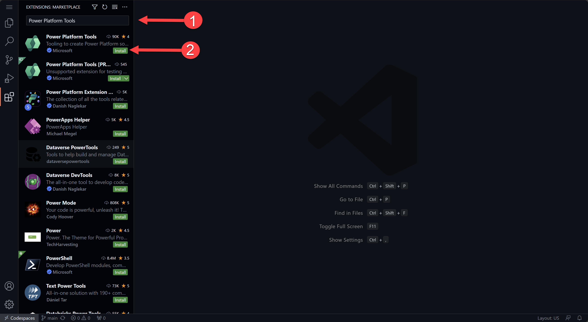

    After installing the **Power Platform Tools** extension, you will be prompted to "Select File Icon Theme". Select any of the 2 options.

    With the Power Platform Tools extension installed, you can now interact with the Power Platform from within Visual Studio Code. But before we can do that, we need to connect to a Power Platform environment.

## Task 6: Connect to the Power Platform environment
    
1. In Visual Studio Code, click on the **Power Platform** icon in the left navigation

    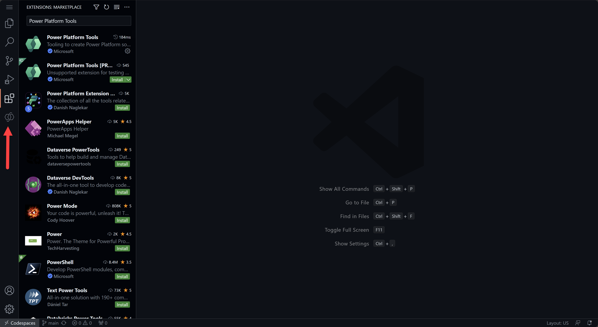

    You'll more than likely see that there is "No auth profiles found on this computer". Let's create one.

    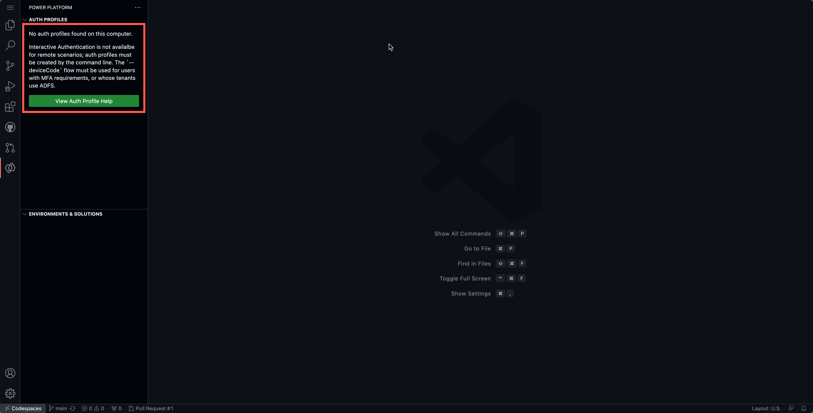

2. If you don't see it open already, let's open the Terminal. Click on the Burger menu icon in the top left corner and then hover over **Terminal** and then click **New Terminal**

    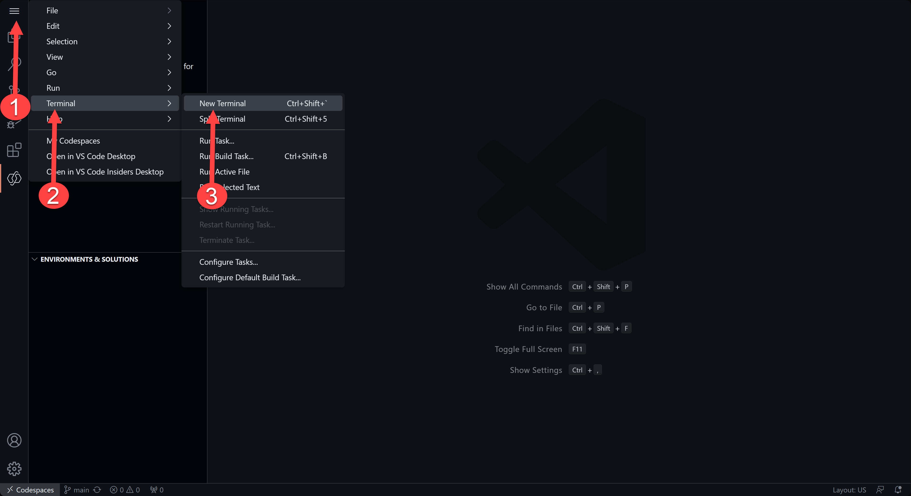

    A terminal window has now been opened for you. This is where you will write all of the following commands in this lab and in the upcoming labs as well.

3. Type the following command in the terminal and then press **Enter**:

    ```bash
    pac auth create --deviceCode
    ```

4. You will be prompted to use a web browser to authenticate. Copy (**ctrl + c**) the ```code``` that is provided in the terminal and then **Ctrl + click** on the ```link``` that is provided in the terminal. 

    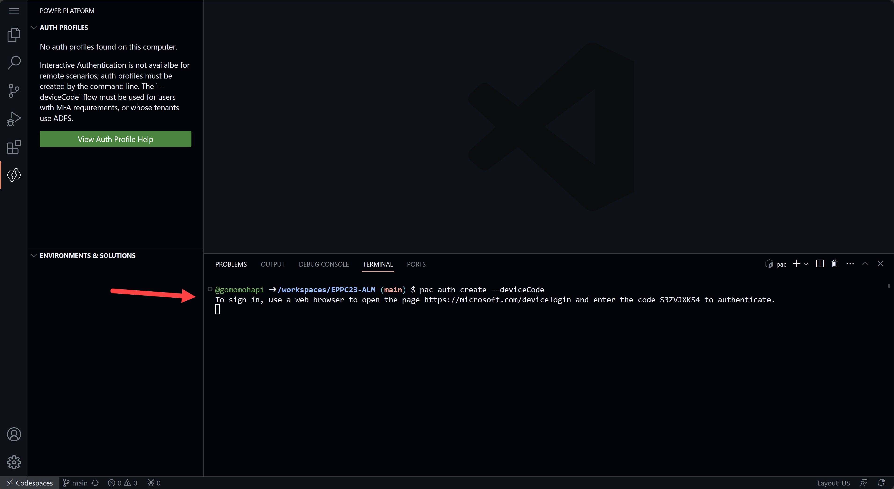

    Once you click on that link, it will open a new browser tab where you will have to paste that code into the browser and then click **Next**    

    > **Note:** If you are using a Mac, you can **Ctrl + click** on the ```link``` that is provided in the terminal and then enter the ``code`` provided.

    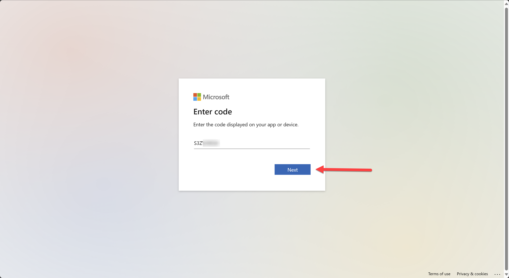

5. Pick the account that was provided to you by the workshop trainers. If you can't see it on screen then log in.

    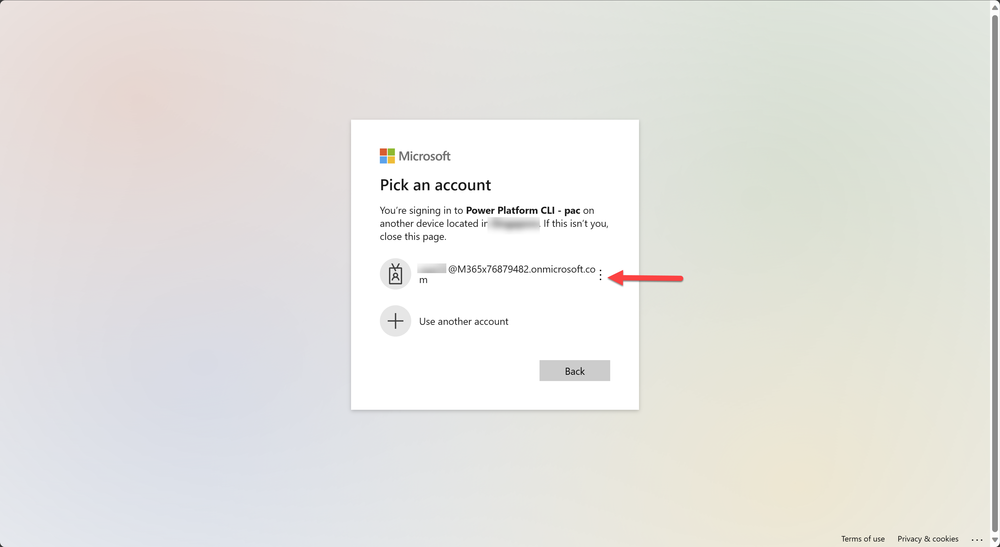

6. Then type in your password and click **Sign in**

    You will then see a page asking if you're trying to sign in to Power Platform CLI - pac. 

    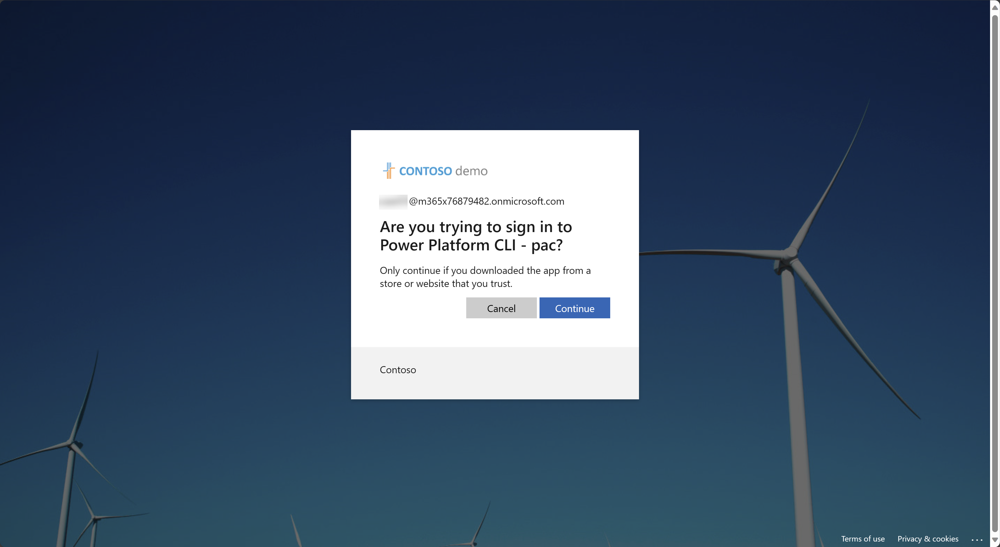

7. Click **Continue**

    You'll then see a prompt confirming that you have successfully signed in to Power Platform CLI - pac. Close the browser tab and return to your codespace.

8. Refresh the Auth Profiles section by clicking on the **Refresh** button next to "Auth Profiles"

    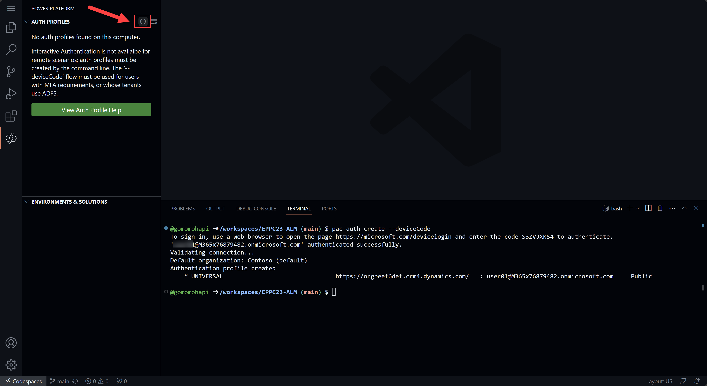

    You should now see at least one auth profile. If you have more than one, you can select the one you want to use by clicking on the **Select Auth Profile** button next to the auth profile.

    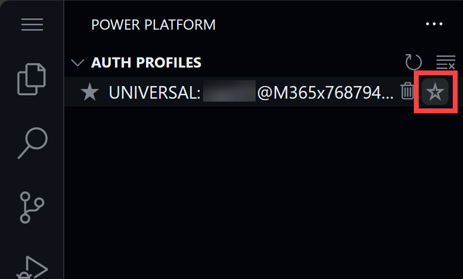

9. With the correct Auth Profile, in the terminal type the following command and then press **Enter**:

    ```bash
    pac env list
    ```

    This gets a list of all the environments that you have access to. You should see the **Dev** environment listed as one of them. This is the one we want to eventually connect to. 

    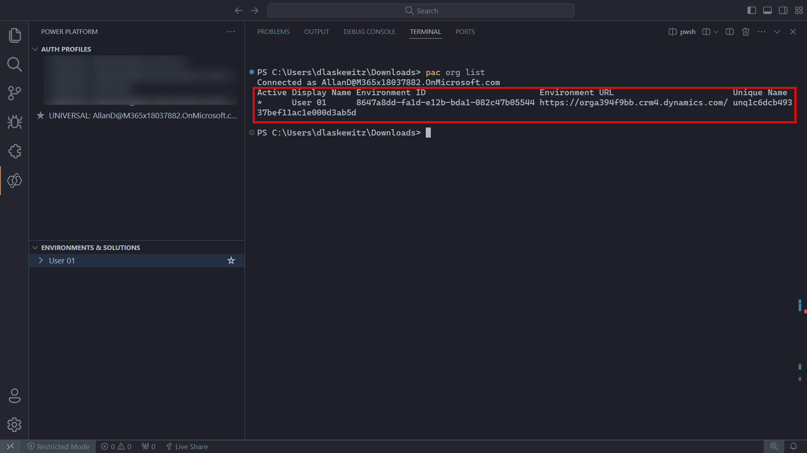

10. Take note of the Environment ID of the **Dev** Environment and copy it. 

    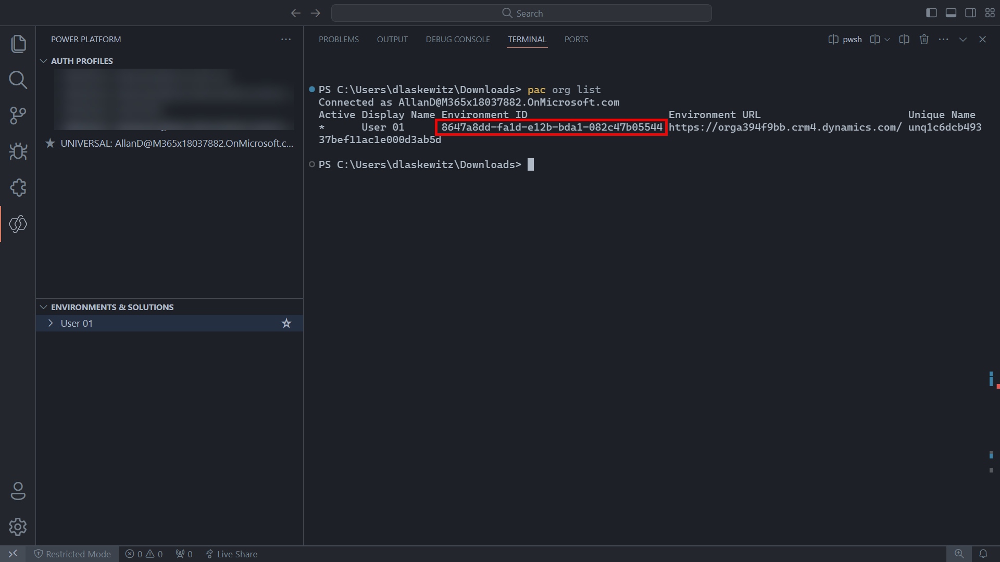

11. Then in the terminal, type the following command and then press **Enter**. Make sure to replace ```00000000-0000-0000-0000-000000000000``` with the environment id that you copied above

    ```bash
    pac env select --environment 00000000-0000-0000-0000-000000000000
    ```

    You should then see confirmation that you have successfully selected the **Dev** org for the current auth profile.

    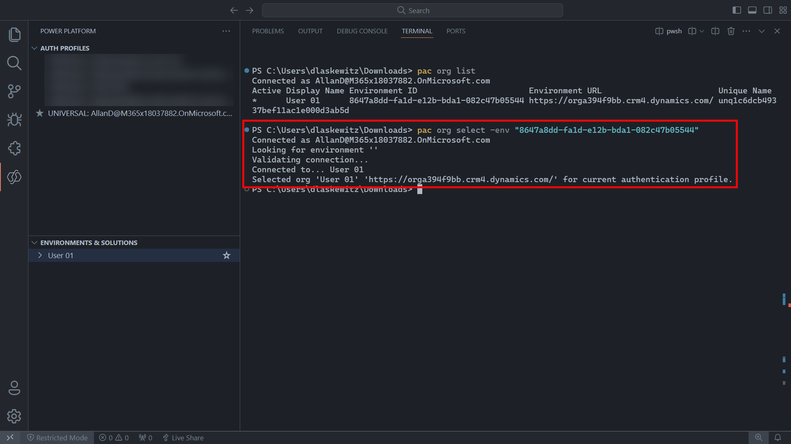

12. To have further confirmation that you have successfully connected to the **Dev** environment, in the terminal type the following command and then press **Enter**:

    ```bash
    pac env who
    ```
    This command will return information about the environment that you are connected to. You should see the **Dev** environment listed as well as other unique information about the environment including the User email you're connected as.

    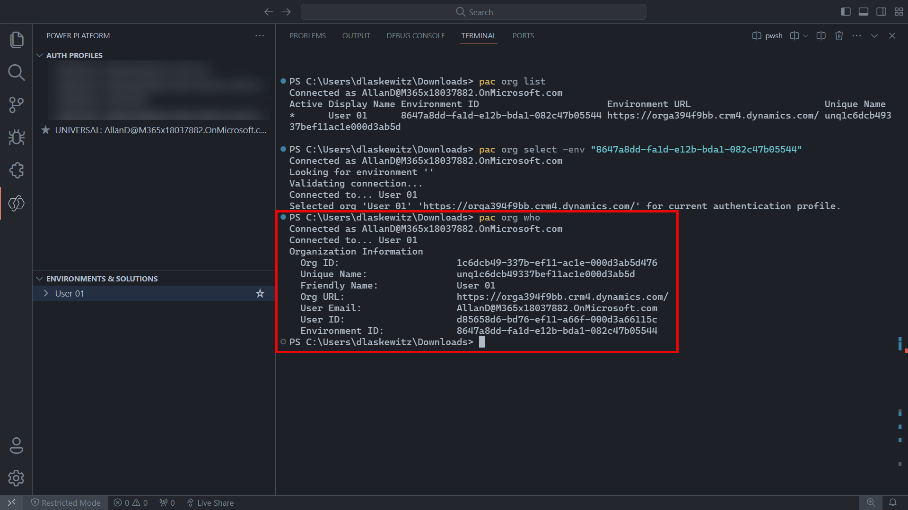

## Next lab

This is the end of lab 01, select the link below to move to the next lab.

[⏭️ Move to lab 02](../lab02/README.md)
