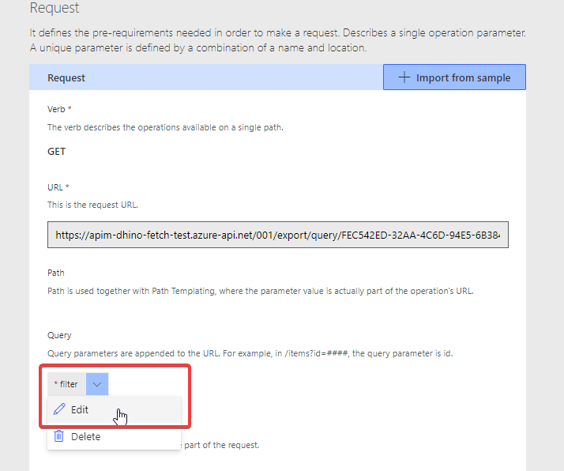
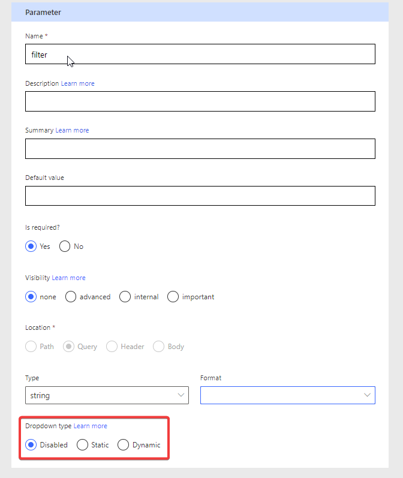
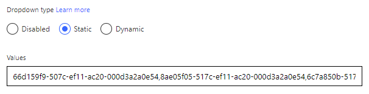
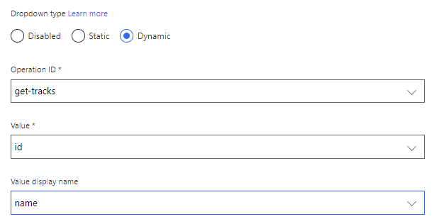
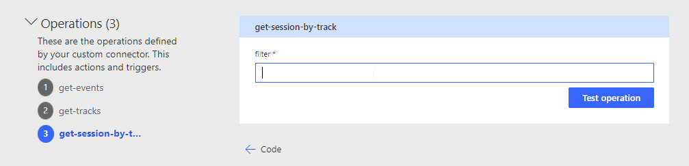

# Lab 03 - Testing and Troubleshooting a Custom Connector 🚨

In this lab, you will go through the following tasks:

* Add dynamic operation
* Using the test pane in the custom connector UI
* Testing a Custom Connector in Power Automate
* Testing a Custom Connector in Power Apps
* Increase the Custom Connector usability

## Task 1: Making an action dynamic
In Lab 2 we added an action with a parameter but noticed the usability was subpar. One way to improve is to replace the manual input field with **Dynamic Values** which are a drop-drown which is not hardcoded but instead uses value from an another action.

Basically we want to achieve this when someone uses this action:
- Make a call to the **Tracks** action to get available Tracks
- Instead of their Id display a readable Description or Name
- When making the call to the SessionByTrack API send the id instead of the displayed Name.

Let's built this! 🙂

We start back on the **Definition** page, select the SessionByTrack action and open the parameter:

On the detail page we will take a more detailled look at the dropdown types. With these we can change the field from manual input to a dropdown from which a user can easily select a value.

The following options are available

- **Disabled**  Default value, no dropdown, just manual input
- **Static** Dropdown, values have to hardcoded in the custom connector. No way to differentiate between id and displayname

- **Dynamic** Dropdown, but this time the value are provided during runtime by another action 👍

We will use the **Dynamic** option in this case
- Select our GET/Tracks action as **Operation Id** (that's why operation id names are important!)
- The **Value** can be picked from the field we defined as the default response in the GET/Tracks action. If there is no response defined, this feature can not be used! In this case we use the **id** property of the Track because the API is requiring this value.
- The **Value Display Name** will be the field which is only used for the user to make it easier to pick the right value. In our case we use the **Name** property of the Track

Awesome let's **Update Connector** an go to our Test page!

## Task 2: Test using the Test page within a Custom Connector

Sadly these (and most of the other UI features) are not supported here 🙁 The Test pages is only for Developers and supports only manual inputs.

🏆 for the shortest task in this workshop, but let's look at the other option we can use for this 👍

## Task 3: Testing in Power Automate
