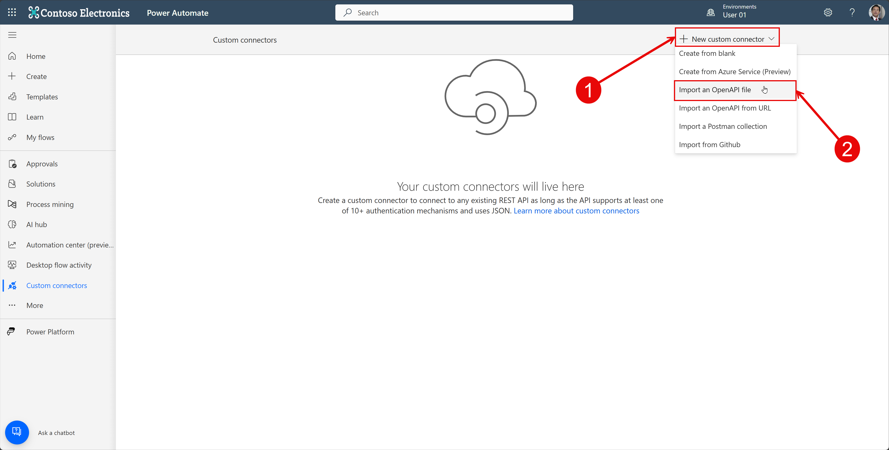

# Lab 04 - Top tips and tricks for Custom Connectors

In this lab, you will learn how to enable the connector as an AI plugin.

Tasks:

1. Import a connector as a OpenAPI v2 (swagger) file
1. Learn how to enable a connector as an AI plugin
1. Test your connector with the local debugging tool

## Task 1: Import a connector as an OpenAPI v2 (Swagger) file

In this task, you will learn how to import a connector as an OpenAPI v2 file.

1. [Download](../resources/ChuckNorris.json) the OpenAPI v2 (Swagger) file from the resources

1. Open the [Power Automate maker portal](https://make.powerautomate.com) and select the **User XX** (where XX is the number of your user) environment which you created in lab 01

    

1. Select **Custom connectors** in the left navigation

1. Select **New custom connector** and **Import an OpenAPI file**

    

1. Enter **ChuckNorris** as the name, and select the `ChuckNorris.json` file you downloaded in step 1

    

## Task 2: Learn how to enable a connector as an AI plugin

## Task 3: Test your connector with the local debugging tool

1. [Download](../resources/plugin-validator.zip) the plugin validator tool and unzip it
