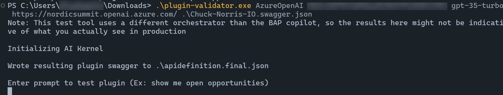

# Lab 04 - Top tips and tricks for Custom Connectors 🧙‍♂️

In this lab, you will go through the following tasks:

* Import a connector as a OpenAPI v2 (swagger) file
* Learn how to enable a connector as an AI plugin
* Test your connector with the local debugging tool
* Make the connector more dynamic by using dynamic schema
* Learn about connection parameters
* Tie it all together with policies

## Task 1: Import a connector via the Power Platform Command-Line Interface (CLI)

In this task, you will learn how to import a connector via the Power Platform Command-Line Interface (CLI).

1. Go to the [ChuckNorris.Io connector](https://github.com/microsoft/PowerPlatformConnectors/tree/dev/independent-publisher-connectors/ChuckNorris.io) on github

1. Download the `apiDefinition.swagger.json` and the `apiProperties.json` files by selecting the name of the file and clicking the download icon on the top right corner 

1. Open Visual Studio Code

1. If you don't see it open already, let's open the Terminal. Select **Terminal** in the menu on the top and select **New Terminal**

    In lab 01 - we already connected to our environment with the Power Platform CLI. If you did everything correctly, you should have the **User XX** (where XX is the number of your user) environment selected. 

1. Check if you have selected the right environment by running the following command

    ```bash
    pac org who
    ```

    This should output to which environment you are connected and with which user.

1. Run the following command to see all the connectors in your environment

    ```bash
    pac connector list
    ```

    This will only output the connectors that are part of Dataverse. So only connectors that are part of a solution will be part of show.

1. Make sure to navigate to the directory where you downloaded the connector files (use `cd ..` and/or `cd .\foldername\` to navigate in the terminal)

1. Lets add the connector we just downloaded via Github by running the following command

    ```bash
    pac connector create -df .\apiDefinition.swagger.json -pf .\apiProperties.json   
    ```

1. Now lets run the `pac connector list` command again, and you'll see something like this:

    

1. Open the [Power Automate maker portal](https://make.powerautomate.com) and select the **User XX** (where XX is the number of your user) environment which you created in lab 01

    

1. Select **Custom connectors** in the left navigation

You should be able to see the Chuck Norris connector in the overview!

## Task 2: Learn how to enable a connector as an AI plugin

In this task, you will learn how to enable the connector as an AI plugin.

1. Select the **Edit** icon next to Chuck Norris IO to edit the connector

1. Select the tab **4. AI Plugin (Preview)** at the top

    This is where you can enable your connector as an AI Plugin. If you are a connector developer and you want to make this connector available for everyone on the Power Platform and not just your own environment, you can do this and certify your connector.

1. First, lets give our manifest a name: **Chuck Norris IO**

1. Add `This plugin helps users to find a random joke from Chuck Norris IO. Users can provide a category or they can leave the category blank if they want a random category.` in the **Description** field

1. Add the email from your user (for instance `user01@m365....`) in the **Contact email** field

1. Add the following URL in the **Legal term URL** field: `https://api.chucknorris.io/privacy`

    

    In the next steps, you can select which plugin actions (or operations) you want to enable as part of the AI Plugin.

1. Scroll down to the bottom of the page and select the **GetRandomChuck...** plugin action

1. Enable the plugin action as an copilot plugin operation by checking the box on the screenshot below

    

1. Select the **GetCategories** plugin action on the left side

1. Enable the plugin action as an copilot plugin operation by checking the box

1. Select the **Update connector** button on the top to update the latest changes we made

1. After the connector is updated, select **Custom connectors** in the left navigation

1. Select the **Download** icon to download the definition

Now we are ready to test the connector AI Plugin!

## Task 3: Test your connector with the local debugging tool

1. [Download](../resources/plugin-validator.zip) the plugin validator tool to the same folder where you downloaded the definition of the connector in the last task and unzip it

1. Open Visual Studio Code

1. If you don't see it open already, let's open the Terminal. Select **Terminal** in the menu on the top and select **New Terminal**

1. Navigate to the directory where you have unzipped the plugin validator and the definition of the connector

1. In the following command, replace `{Key}` by the key you got from us through the email and run the adjusted command in the terminal

    ```powershell
    .\plugin-validator.exe AzureOpenAI {Key} gpt-35-turbo https://nordicsummit.openai.azure.com/ .\Chuck-Norris-IO.swagger.json    
    ```

    This will start the plugin validator. The plugin validator gives us an idea of how the AI plugin would respond to our prompts.

    

1. Ask the following question: 

    ```text
    Can you get me a Chuck Norris joke?
    ```

    This should give you the following response:

    

    As you can see, the operationId equals `GetRandomChuckNorrisFact` and that's what we expect when we enter a prompt like that. 

1. Ask the following question to make it a bit more complicated:

    ```text
    Can you get me a Chuck Norris joke from the dev category?
    ```

    This should give you the following response:

    

    As you can see, the operationId equals `GetRandomChuckNorrisFact` as well, but there is a major difference. At the end of the URL you can see `?category=dev`. The AI Plugin is smart enough to add that to the URL based on the connector definition we used.

## Task 4: Make the connector more dynamic by using dynamic schema

## Task 5: Learn about connection parameters

## Task 6: Tie it all together with policies
